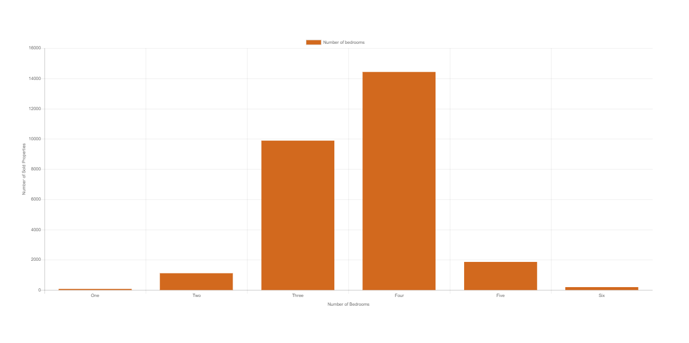

# Perth Housing Market from 2005 to 2020

In this project, some data visualisations are presented in regards to Perth Metro Housing Market. 

The most popular house styles are identified based on parameters such as number of bedrooms, land size, property age, distance to CBD and suburbs.

Some of the following graphs could be created:
    - median housing price per year
    - median housing price per distance from CBD
    - a geomap of the property prices in different suburbs
    - estimate of changes in property prices and the total stock of housing in Perth and Melbourne

I have already found a csv file to start my analysis and will try to find another resource in csv or API format to be able to merge my data and get more appropriate information.

This data analysis could be useful for real estate investors and industry, in general, to know the most potent locations for their investments.
 
 

