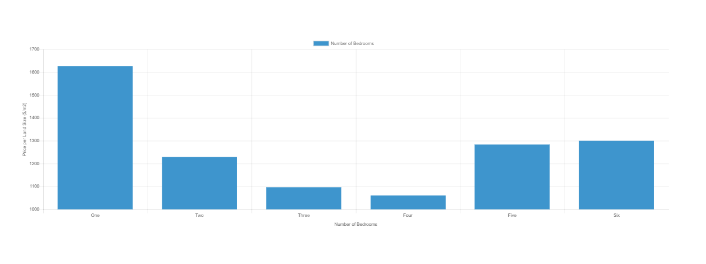
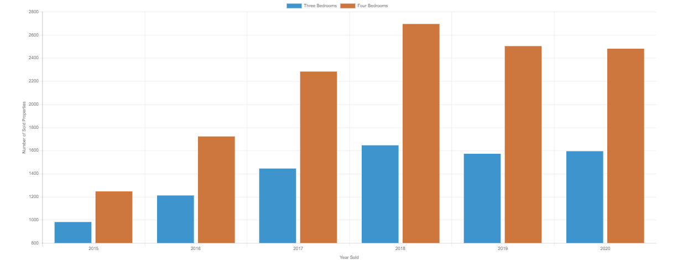
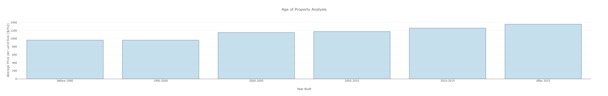
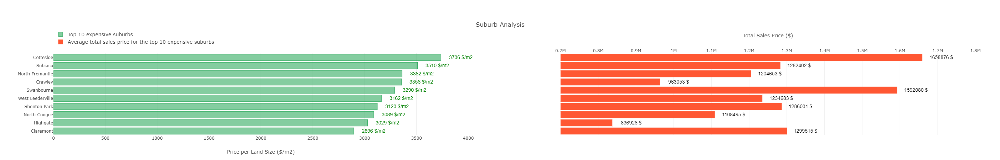
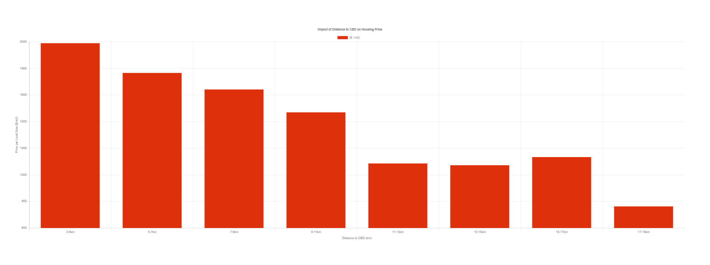
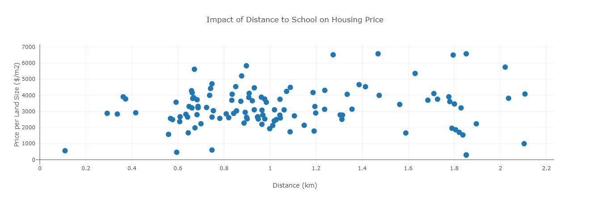
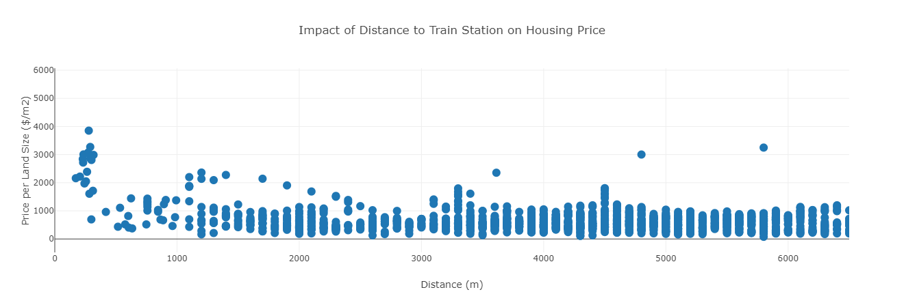

# Perth Housing Market from 2005 to 2020

In this project, some data visualisations are presented in regards to Perth Metro Housing Market. 

The most popular house styles are identified based on parameters such as number of bedrooms, land size, property age, distance to CBD and suburbs.

Below are some of the questions to be answered based on data analysis related to Perth Properties sold between 2005 and 2020:

1. How the number of bedrooms influence a home's value? 
According to the analysis four bedroom properties were the cheapest considering their price per land ($/m2).

2. How popular are three and four bedrooms properties sold between 2015 and 2020?
The number of sold four bedroom properties increased from 2015 to 2018. The ratio of sold dwellings with 4 bedrooms remained 1.5 times higher than 3 bedrooms within this period.

3. How the age of the property affects the price?
The price of the properties per land area increases from around 1000($/m2) for properties built before 1990s to around 1400($/m2) for properties built after 2015. 

4. What are the most expensive suburbs in Perth?
**Cottesloe** is the most expensive suburb and **Swanbourne** is the second most expensive suburb when comparing the total price of dwellings sold between 2005 and 2020.

5. How the distance to CBD, Schools and Train Stations influence the housing prices?

    - median housing price per year
    - median housing price per distance from CBD
    - a geomap of the property prices in different suburbs
    - estimate of changes in property prices and the total stock of housing in Perth and Melbourne

I have already found a csv file to start my analysis and will try to find another resource in csv or API format to be able to merge my data and get more appropriate information.

This data analysis could be useful for real estate investors and industry, in general, to know the most potent locations for their investments.
 
 

